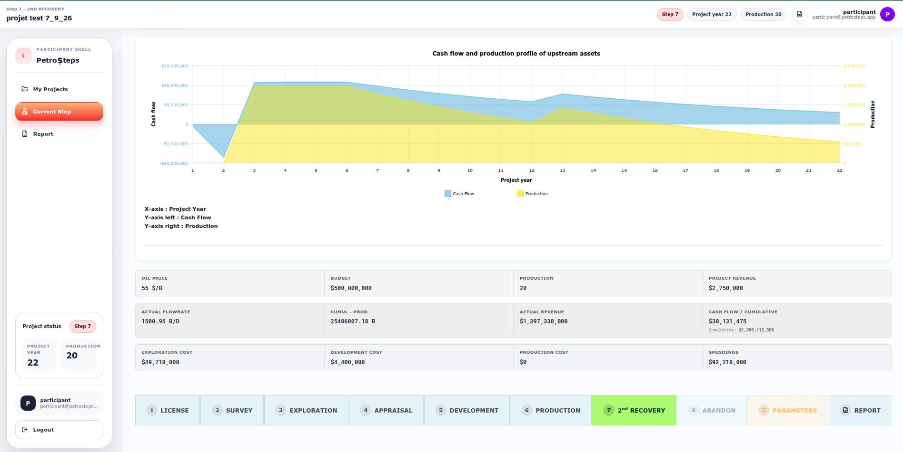

# Petrosteps

An interactive training platform for learning and simulating the complete lifecycle of an upstream oilfield project.

## Overview

Petrosteps helps trainers and participants work through the economic and operational decisions of an oilfield project. A simulation progresses from licensing and exploration to development, production, secondary recovery, and abandonment while tracking production, revenue, spending, and cash flow.

## Problem

Oilfield lifecycle training combines technical operations, project sequencing, and economic consequences. Petrosteps makes those relationships visible in one guided workflow instead of separating them across slides and spreadsheets.

## Product

The application supports four role-based workspaces:

- Super administrators manage administrators and system access.
- Administrators configure blocks, fields, wells, facilities, countries, and simulation parameters.
- Trainers create and supervise participant accounts and projects.
- Participants run an eight-stage oilfield simulation and generate a project report.

## My Role

Songnia Wilfried Tresor worked on the full-stack product implementation, simulation workflows, role-based interfaces, responsive design, economic KPIs, production graph, and PDF reporting.

## Architecture

Petrosteps is a server-rendered PHP monolith. PHP pages handle HTTP requests and render the UI, a shared PDO class provides MySQL access, and session state coordinates authentication and the active simulation. AJAX endpoints update annual production and refresh project data without a frontend build step.

See [Architecture](docs/ARCHITECTURE.md) for the detailed request and data flows.

## Tech Stack

### Frontend

- Server-rendered HTML and CSS
- Bootstrap 5 with a custom Material Design 3 theme
- Vanilla JavaScript and jQuery
- amCharts for production and cash-flow visualization

### Backend

- PHP 8
- PDO-based MySQL access
- PHP sessions with role-based navigation and route checks
- Legacy mPDF integration for PDF reports

### Data

- MySQL 8
- SQL schema and anonymized reference data

### Infrastructure / Integrations

- Traditional PHP web server deployment
- Google Fonts and Bootstrap CDN assets
- No payment provider or external business API detected

## Key Features

- Eight-stage oilfield lifecycle simulation
- Configurable blocks, fields, wells, facilities, oil price, budget, and production OPEX
- Annual production decline, cumulative production, revenue, spending, and cash-flow calculations
- Primary and secondary recovery workflows
- Role-based administration for trainers and participants
- Responsive participant dashboard and mobile navigation
- Detailed browser and PDF project reports
- Public product landing page with contact capture

## Engineering Challenges

- Preserving a continuous production history when secondary recovery starts
- Separating production and cash flow on a dual-axis chart
- Keeping project-year and production-year scales consistent
- Converting cumulative operational events into annual graph values
- Maintaining compatibility with a legacy PHP codebase while modernizing the interface

## Screenshots



## Local Development

### Requirements

- PHP 8.1 or newer with PDO MySQL
- MySQL 8
- A PHP-compatible web server, or the PHP development server

### Installation

```bash
git clone https://github.com/Songnia/petrosteps.git
cd petrosteps
cp .env.example .env
mysql -u root -p -e "CREATE DATABASE oilsteps CHARACTER SET latin1"
mysql -u root -p oilsteps < database/schema.sql
mysql -u root -p oilsteps < database/reference-data.sql
php -S localhost:8080
```

The repository intentionally contains no user account or reusable password. Create the first administrator directly in your local database using a credential dedicated to that environment. The current authentication scheme is documented as a legacy risk in [Security](docs/SECURITY.md).

### Environment Variables

The application reads configuration from the process environment. Use `.env.example` as the variable reference; PHP does not automatically load `.env`, so export the variables through your shell, web server, container, or hosting control panel.

```bash
export APP_URL=http://localhost:8080
export APP_ENCRYPT_KEY='replace-with-a-long-random-secret'
export DB_HOST=127.0.0.1
export DB_DATABASE=oilsteps
export DB_USERNAME=root
export DB_PASSWORD='your-local-password'
```

## Testing

The current codebase has no automated unit or integration test suite. CI performs syntax validation on application PHP files. Run the same check locally with:

```bash
find . -path './mpdf' -prune -o -name '*.php' -print0 | xargs -0 -n1 php -l
```

## Deployment

Configure environment variables outside the repository, import the schema, restrict public access to `database/`, `storage/`, and internal configuration files, and serve the project through PHP-FPM or Apache PHP. See [Deployment](docs/DEPLOYMENT.md).

No stable public production URL could be verified from the current source configuration.

## Security

Secrets and production credentials are managed through environment variables and are not committed to Git. Database exports containing users or project records are excluded. Known legacy security debt is documented transparently in [Security](docs/SECURITY.md).

## Status

Active development. The product workflow is functional; authentication hardening, CSRF coverage, automated tests, and dependency modernization remain planned engineering work.

## Author

**Songnia Wilfried Tresor**

Product Engineer | Full-Stack Developer | AI & Automation

[GitHub](https://github.com/Songnia)
