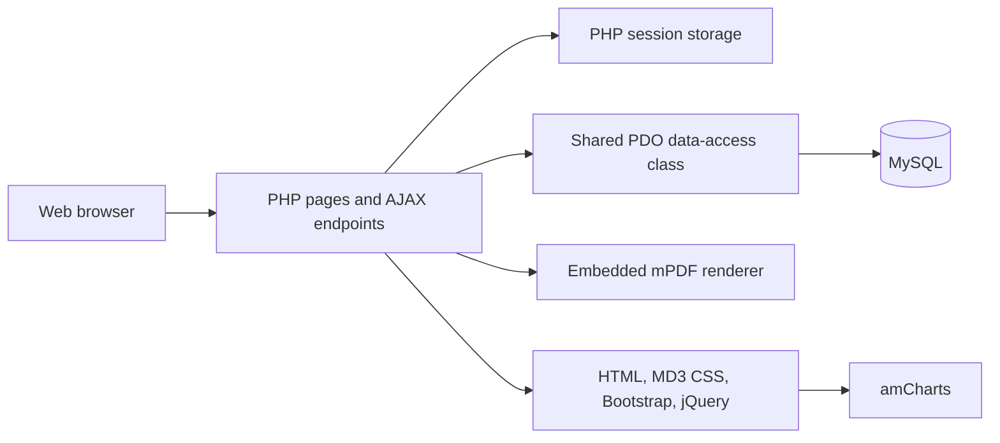

# Architecture

## System Context

Petrosteps is a server-rendered PHP application used by administrators, trainers, and participants. It has no separate SPA, REST API, queue, payment service, or cloud storage integration.

## Application Layers

| Layer | Location | Responsibility |
| --- | --- | --- |
| Public entry | `landing.php`, `login.php`, `index.php` | Marketing, authentication, role routing |
| Role dashboards | `dashboard_*.php` | Role-specific navigation and summaries |
| Simulation | `project_step1.php` to `project_step8.php` | Oilfield lifecycle tasks and calculations |
| Async updates | `ajax_*.php` | Lists, production increments, and graph refreshes |
| Shared presentation | `includes/navbar.php`, `includes/user_*.php`, `css/` | Admin and participant shells |
| Data access | `includes/db.class.php` | PDO connection and database operations |
| Reporting | `report.php`, `includes/report_*.php`, `mpdf/` | Browser report and PDF generation |
| Data definition | `database/schema.sql`, `database/reference-data.sql` | Reproducible schema and non-user reference data |

## Main Workflow

1. A user authenticates and receives a PHP session.
2. The application routes the user according to `user_type`.
3. A participant selects or creates a project.
4. Each simulation task updates the project record and appends timeline data to `tbl_project_step`.
5. Production increments calculate yearly barrels, revenue, OPEX, spending, and cash flow.
6. The report layer reconstructs project metrics and renders HTML or PDF output.

## Data Model

- `tbl_admin`: users, roles, trainer assignment, and active session metadata.
- `tbl_project`: current aggregate state for each simulation.
- `tbl_project_step`: cumulative production and spending snapshots used by the graph.
- `tbl_block`, `tbl_field`, `tbl_well`: geological and operational reference data.
- `tbl_production_facility`: facility capacity and capital/decommissioning costs.
- `tbl_parameters`, `tbl_project_years`: global economic and timeline settings.
- `tbl_countries`, `tbl_state`: account location reference data.

## External Dependencies

Third-party frontend libraries and a legacy mPDF distribution are committed because the project currently has no package manager. Google Fonts and Bootstrap are also loaded from public CDNs on modernized pages.

## Architectural Constraints

- Session state and database state are tightly coupled during a simulation.
- Several data-access methods build dynamic SQL and need staged hardening.
- The embedded mPDF version limits straightforward upgrades to newer PHP versions.
- There is no automated migration runner; SQL files are applied manually.
